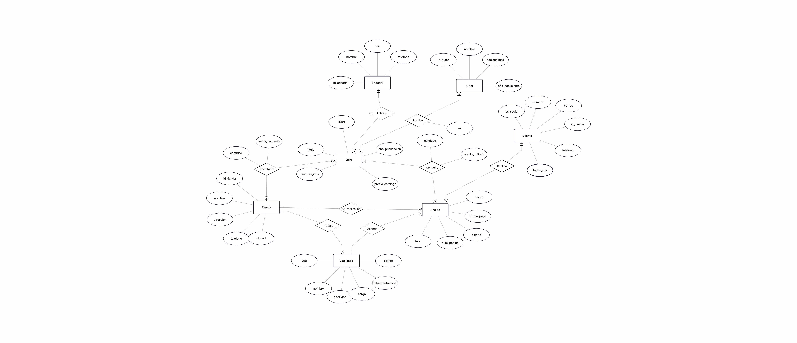

# Apartados de la base de datos

## Apartado 1. Resumen del caso

>La dueña de "Paginas de Villa Serena" nos pide ayuda con la gestion de sus productos entre\
>tiendas, necesita poder ubicar libros entre las diferentes tiendas y poder conocer de\
>ello sus cantidades por tienda, a su vez le gustaria poder encontrar libros buscando\
>simplemente por el nombre de su autor, en base al stock quiere poder saber exactamente\
>el numero de copias de cada libro y cuando fue que se conto su cantidad.\
>Ahora hablando de personal y clientes, pide ayuda para saber sus datos, del personal ademas\
>su fecha de contratacion y correo de trabajo, los clientes pueden convertise en socios\
>si lo son, se guardara tambien su telefono y la fecha en la que se dio de alta como socio.\
>Por ultimo, basandose en un ticket de ejemplo se nos pide que al revisar pedidos antiguos\
>mantengan el precio de los productos que tenian en ese entonces.

## Apartado 2. Analisis del caso

### Las tiendas

1. Tiendas (Centro, Ribera *(está en el pueblo vecino de Aldeaverde)* y Universidad)
- Nombre
- Dirección
- Numero de teléfono
- Ciudad

### El catalogo

1. Libros
 - ISBN (13 cifras)
 - Titulo
 - Año de publicación
 - Numero de paginas
 - Precio en el catalogo

2. Editoriales 
 - Nombre
 - País
 - Teléfono de contacto

 >"Un libro lo publica una sola editorial"

3. Autores 
 - Nombre
 - Nacionalidad
 - Año de nacimiento

 >"Hay libros escritos por dos o tres personas"\
 >"Distinguir si el autor es principal o colaborador en cada libro (por ejemplo, quién hace el prólogo)."

### Inventario

1. Stock
 - Copias de libro por tienda
 - Ultima vez que se conto el stock

>"Un libro puede no estar en una tienda; en ese caso, simplemente no aparece."

### Personal

1. Empleados
 - DNI
 - Nombre
 - Apellidos
 - Cargo
 - Fecha Contratacion
 - Correo de trabajo

>"En cada tienda trabajan varios empleados, y cada empleado trabaja en una sola tienda."\
>"Si un empleado cambia de tienda, no me importa guardar el historial; simplemente que figure en la nueva."

2. Clientes
 - Nombre completo
 - Correo (único, lo usan para enviar avisos)
 - Telefono (Solo si socio)
 - Fecha Alta (Solo si socio)

>"Los clientes pueden darse de alta como socios y así obtienen descuentos."
### Ventas

1. Pedido
 - Nº de identificacion
 - Nombre del dependiente (+ Su Ocupacion)
 - Cliente
 - Fecha
 - Forma de pago (efectivo, tarjeta o bizum)
 - Estado (preparado, entregado o cancelado)

>"Un pedido se hace siempre en una tienda, lo atiende un empleado y lo compra un cliente."
>"Cada pedido puede llevar varios libros distintos, y de cada uno me interesa la cantidad."
>"Si abro un pedido antiguo y me enseña el precio nuevo, la factura ya no cuadra. Quiero que cada pedido guarde lo que realmente se cobró por cada libro."

### Preguntas A Responder

- ¿Qué libros tiene la tienda Centro y cuántas copias quedan?
- ¿Cuál es el libro más vendido en cada tienda?
- ¿Cuánto ha facturado cada tienda este año?
- ¿Qué clientes han hecho más de dos pedidos?
- ¿Qué libros están agotados en una tienda pero disponibles en otra?
- ¿Qué empleado ha atendido más pedidos?
- ¿Qué autores tienen libros en más de una editorial?

### Notas Gestora

#### lo que no queremos tener al final

| Libro | Autor | Editorial | Precio | Stock | Contado el |
|---|---|---|---|---|---|
| Rayuela | Julio Cortázar | Alfaguara | 16,50 | 4 | 02/03/2026 |
| Ficciones | Jorge Luis Borges | Alianza | 12,00 | 2 | 02/03/2026 |
| Cuentos de Eva Luna | Isabel Allende | Plaza & Janés | 14,90 | 0 | 02/03/2026 |
| Antología del cuento | Cortázar / Borges | Alianza | 18,00 | 6 | 28/02/2026 |

>"algunos libros tienen más de un autor"

### Cardinalidades del diagrama entidad-relación

| **Relación**                      | **Cardinalidad** | **Razonamiento**                                                                          |
| --------------------------------- | ---------------- | ----------------------------------------------------------------------------------------- |
| Editorial – Libro (`Publica`)     | `1:N`            | Una editorial puede publicar muchos libros; cada libro pertenece a una sola editorial.    |
| Autor – Libro (`Escribe`)         | `N:M`            | Un autor puede escribir muchos libros y un libro puede tener varios autores.              |
| Tienda – Libro (`Inventario`)     | `N:M`            | Una tienda puede tener muchos libros y un libro puede estar disponible en varias tiendas. |
| Pedido – Libro (`Contiene`)       | `N:M`            | Un pedido puede contener varios libros y un libro puede aparecer en muchos pedidos.       |
| Cliente – Pedido (`Realiza`)      | `1:N`            | Un cliente puede realizar muchos pedidos; cada pedido pertenece a un solo cliente.        |
| Tienda – Pedido (`Se_realiza_en`) | `1:N`            | Una tienda puede gestionar muchos pedidos; cada pedido se realiza en una sola tienda.     |
| Tienda – Empleado (`Trabaja`)     | `1:N`            | Una tienda puede tener muchos empleados; cada empleado trabaja en una sola tienda.        |
| Empleado – Pedido (`Atiende`)     | `1:N`            | Un empleado puede atender muchos pedidos; cada pedido es atendido por un empleado.        |

#### Diagrama Entidad-Relacion

